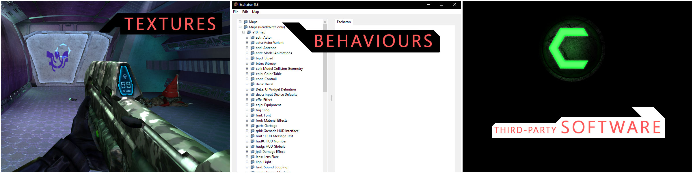

  A general overhaul mod for Halo: Combat Evolved

## What?

## What?
2K20's main goal is to bring the game to the year 2020, by upgrading gameplay,
visuals and screen ratio, while trying to maintain consistency with the original
game.

## Who?
2K20 is made for every PC gamer: PGM, beginner, modder, curious, streamer...

## How?
This mod is particular, because the main technical goal is to ONLY update original
textures/maps/behaviours. So there is no new tag, no 2K HD HUD, otherwise a redesign
of everything already here. This choice is motivated by two mane reasons:
 - I am a passionate tunner, not a skilled modder
 - Pushing the game as its maximum "as is" is a personal bet and a mark of respect for BUNGIE's work

# Table of Contents

* [**Requirements**](#requirements)
* [**Setup**](#setup)
  * [Backup](#backup)
  * [Prerequisite](#prerequisite)
    * [Chimera](#chimera)
      * [Install an old version of Chimera](#install-an-old-version-of-chimera)
      * [Configure Chimera](#configure-chimera)
    * [InjectSMAA](#injectsmaa)
  * [Installation](#installation)
    * [Maps](#maps)
      * [Visuals and behaviours](#visuals-and-behaviours)
    * [Anti-aliasing-with-injectsmaa](#anti-aliasing-with-injectsmaa)
    * [Update Launcher](#update-launcher)
  * [Partial Installation](#partial-installation)
    * [Build](#build)
      * [Behaviours](#behaviours)
      * [Textures](#textures)
* [**Roadmap**](#roadmap)
* [**Known bugs**](#known-bugs)
* [**Remove**](#remove)
* [**Credits**](#credits)
* [**Links**](#links)
* [**Microsoft Intellectual Property**](#microsoft-intellectual-property)

# Requirements

This mod supports Halo: Combat Evolved [ENGLISH] version 1.10 and is tested ONLY
on a 1080p definition (1920 x 1080 pixels).

# Setup

Ready to setup the mod? Let's go!

# Backup

...

@todo

...

# Roadmap

| Version          | Features                                                                                                             | Release |
| ---------------- | -------------------------------------------------------------------------------------------------------------------- | ------- |
| v0.1.0 ALPHA     | UPDATE behaviours in campaign (unfinished) UPDATE textures (unfinished) ADD Third-party software configuration | Q3 2019 |
| v0.2.0 ALPHA     | UPDATE main menu UI - Halo Reach like (finished) UPDATE existing textures ADD new textures                     | Q4 2019 |
| v1.0.0  BETA     | FIX all major issues UPDATE campaign behaviours UPDATE textures                                                | Q4 2019 |
| v1.0.X    RC     | PUBLIC RELEASE Official release                                                                                      | Q1 2020 |

# Know bugs

- Behaviour/117: increasing walking speed causes side effects, such as "jumps on collision"
- Behaviour/Loaded plasma shot: increasing the velocity of the projectile makes it difficult to follow any target
- Texture/Needer: ammo counter on HUD is broken since magazine capacity has been increased to 22
- Texture/Jackal: texture of the upper jaw's teeth collide each other
- Texture/Sand: on some maps, the color is too damn pronounced (literally gold color on blood gulch)
- Texture/Main menu: given that Reach main menu is not finalized, it can be tricky to use it in some ways

# "I AM GRO....SLIPGUERRE!"
I'm Slip2Guerre, a french Halo 1 veteran who love crushing grunts
with its hog and sticking Elites. What's more normal.

## My BORING story
A friend of the family gave me a cracked version of Halo PC at the end of 2003.
 A the time, I had the chance to have my own computer powered by Windows XP SP1, 256Mb of RAM
 and a flat screen with a 4/3 resolution (1024 x 768 pixels). Almost immediately after
 I started playing the game (my first FPS experience ever), I began to both
 rage and love the game... I was so bad that I was trying to kill at
 distance Elites using the plasma pistol. Time passed, other
 games were released, and I was still on Halo: CE for good, doing headshots with
 the M6D, a pistol which is more a BR than a pistol. I used to have a team, then I
 created mine, we won matchs, losed others, etc. I discovered the skinning community (before the
 modding community) and started doing my own skins using MS Paint or Photofiltre.
 In 2011 I organised a multiplayer tournament for 40 french players. It was good,
 but I was so jaded by the same mechanics and graphics. So I started working on A
 Halo REACH menu and new reticles sporadically. In june 2019 I discovered Chimera and
 the associated Discord. I discovered that not only the community was still active, but
 was benevolent again, like in 2004's. This gave my the necessary motivation to
 concretize my vision of the game and the sharing within this mod.

 Credits:
 Microsoft Game Studios, 343 Industries, and Bungie: for Halo
# Microsoft Intellectual Property & BUNGIE <3

I do not own any of the original Halo: Combat Evolved file. It is the property
of Microsoft and thereby protected under their End-User License Agreement (EULA)
or License Terms.
